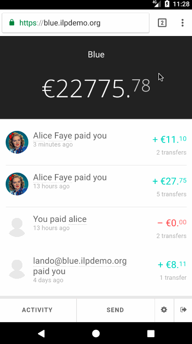

# Interledger Payment App Example

This is a project that was done as part of a hack-o-thon organized at the [Interledger Workshop at Blockchain Expo](https://www.eventbrite.com/e/interledger-workshop-at-blockchain-expo-1-2-june-berlin-tickets-34221014977). This repo is meant as a showcase of an Android payment app, using the Interledger spec for payment.

As such, it contains both the website implementation of the [Payment Request](https://www.w3.org/TR/payment-request) and a Payment App itself. In order for the Payment App to be presented as a payment choice for the user through the Payment Request sheet, two conditions have to be met:

1. The fake website implementation using the Payment Request API has to specify an [Interledger Payment Method](https://w3c.github.io/webpayments/proposals/interledger-payment-method.html)
2. A payment app with an Interledger payment method has to be installed

As of writing, only [Chrome Canary 60+](https://codereview.chromium.org/2850503002) supports Payment Apps. These are automatically discovered by Android when they expose an `intent-filter` as such: https://github.com/Shopify/interledger-payment-app-example/blob/4f8185ead3ecfd95d12f06c812e76022ca4917c4/PaymentApp/app/src/main/AndroidManifest.xml#L23.

Once the user choses the Payment App through the payment sheet, the sheet then transfers control to the Payment App, which deals with the payment.

For more information, you can read up on:

- [Payment Handler API spec](https://w3c.github.io/payment-handler), which deals with how to register Payment App in the browser
- [Interledger website](https://interledger.org), which contains all the information needed about Interledger
- [Android payment app integration into Android web browsers](https://docs.google.com/document/d/1izV4uC-tiRJG3JLooqY3YRLU22tYOsLTNq0P_InPJeE/edit), for a quick overview of the interaction between `PaymentRequest` and a `PaymentApp`

This repo focuses on Google's beta implementation of Payment App's on Android, through Chrome Canary 60+.

## Demo



This demo shows off transfering an amount from ledger **alice@red.ilpdemo.org** to **blue@red.ilpdemo.org**.

Both wallets have been implemented as an initiative to show off the Interledger spec.

## Some assumptions

As with any project in a hack-o-thon, a few shortcuts were taken for simplicity:

1. The app has hardcoded user credentials for the originating ledger (see: https://github.com/Shopify/interledger-payment-app-example/blob/4f8185ead3ecfd95d12f06c812e76022ca4917c4/PaymentApp/app/src/main/java/com/shopify/paymentapp/Credentials.java#L8); In a real world use case, the user would be expected to authenticate within the app to a third party ledger (a wallet for example)

2. The destination ledger is a heroku instance of the ILP Kit in Node that can be found [here](https://github.com/interledgerjs/ilp-kit); if it is ever down, you can change it to any website that implements the same endpoints here: https://github.com/Shopify/interledger-payment-app-example/blob/4f8185ead3ecfd95d12f06c812e76022ca4917c4/www/index.html#L17

## Prerequisites

### Languages

- Python
- Java

### Libraries

- android-sdk

## Setup

1. Install the android system image used for the emulator

  ```
  sdkmanager "system-images;android-25;google_apis;x86"
  ```

2. Install Android platform tools

  ```
  sdkmanager "platforms;android-25"
  ```

3. Create the Android emulator using the Pixel XL image

  ```
  avdmanager create avd --package "system-images;android-25;google_apis;x86" --name "payment-app-device" --tag "google_apis" -d "pixel_xl"
  ```

4. Enable hardware keyboard in the emulator config, for sanity

  ```
  sed -ie 's/hw\.keyboard=no/hw\.keyboard=yes/g' ~/.android/avd/payment-app-device.avd/config.ini
  ```

5. Appending some additional Android emulator configurations

  ```
  echo "showDeviceFrame=yes\nskin.name=1440x2560\nhw.gpu.enabled=yes\nhw.gpu.mode=host" >> ~/.android/avd/payment-app-device.avd/config.ini
  ```

6. Finish setup of the emulator by:

    1. Running the emulator

    ```
    ./bin/start_emulator
    ```

    2. In a separate window, running

    ```
    ./bin/setup_emulator
    ```  

7. Then, in the Android emulator, launch **Chrome Canary**

8. Visit `chrome://flags/#android-payment-apps`

9. Enable the Android Payment Apps beta flag as such:

  

10. Close the emulator

## Playing around

**Important:** You'll have to find a way to serve the channel through HTTPS, as `PaymentRequest` only works with SSL. There's a few ways of doing this, but the easier way is to use a proxy or tunneling service (like [Ngrok](https://ngrok.com)).

1. Start the channel

  ```
  ./bin/start_channel
  ```

2. Somehow enable SSL for said channel (through a proxy or tunneling service, as explained higher up)

3. Start the emulator

  ```
  ./bin/start_emulator
  ```

4. Open up Chrome Canary and visit the channel URL (remember, it has to support SSL)

5. Click on **Buy**
